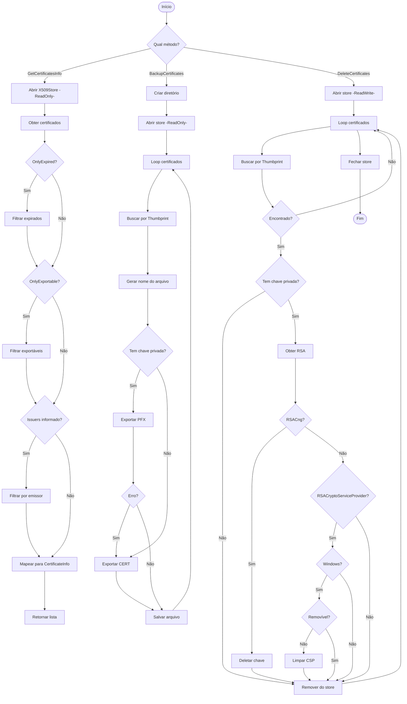

```mermaid
flowchart TD

    START([Início]) --> METHOD{Qual método?}

    %% =========================
    %% GetCertificatesInfo
    %% =========================
    METHOD -->|GetCertificatesInfo| A1[Abrir X509Store -ReadOnly-]
    A1 --> A2[Obter certificados]

    A2 --> A3{OnlyExpired?}
    A3 -- Sim --> A4[Filtrar expirados]
    A3 -- Não --> A5

    A4 --> A5{OnlyExportable?}
    A5 -- Sim --> A6[Filtrar exportáveis]
    A5 -- Não --> A7

    A6 --> A7{Issuers informado?}
    A7 -- Sim --> A8[Filtrar por emissor]
    A7 -- Não --> A9

    A8 --> A9[Mapear para CertificateInfo]
    A9 --> A10[Retornar lista]

    %% =========================
    %% BackupCertificates
    %% =========================
    METHOD -->|BackupCertificates| B1[Criar diretório]
    B1 --> B2[Abrir store -ReadOnly-]

    B2 --> B3[Loop certificados]
    B3 --> B4[Buscar por Thumbprint]

    B4 --> B5[Gerar nome do arquivo]
    B5 --> B6{Tem chave privada?}

    B6 -- Sim --> B7[Exportar PFX]
    B6 -- Não --> B8[Exportar CERT]

    B7 --> B9{Erro?}
    B9 -- Sim --> B8
    B9 -- Não --> B10

    B8 --> B10[Salvar arquivo]
    B10 --> B3

    %% =========================
    %% DeleteCertificates
    %% =========================
    METHOD -->|DeleteCertificates| C1[Abrir store -ReadWrite-]

    C1 --> C2[Loop certificados]
    C2 --> C3[Buscar por Thumbprint]

    C3 --> C4{Encontrado?}
    C4 -- Não --> C2
    C4 -- Sim --> C5{Tem chave privada?}

    C5 -- Não --> C9[Remover do store]
    C5 -- Sim --> C6[Obter RSA]

    C6 --> C7{RSACng?}
    C7 -- Sim --> C8[Deletar chave]
    C7 -- Não --> C11{RSACryptoServiceProvider?}

    C11 -- Sim --> C12{Windows?}
    C12 -- Sim --> C13{Removível?}
    C13 -- Não --> C14[Limpar CSP]
    C13 -- Sim --> C9

    C12 -- Não --> C9
    C11 -- Não --> C9

    C8 --> C9
    C14 --> C9

    C9 --> C2

    C2 --> C15[Fechar store]
    C15 --> END([Fim])
```